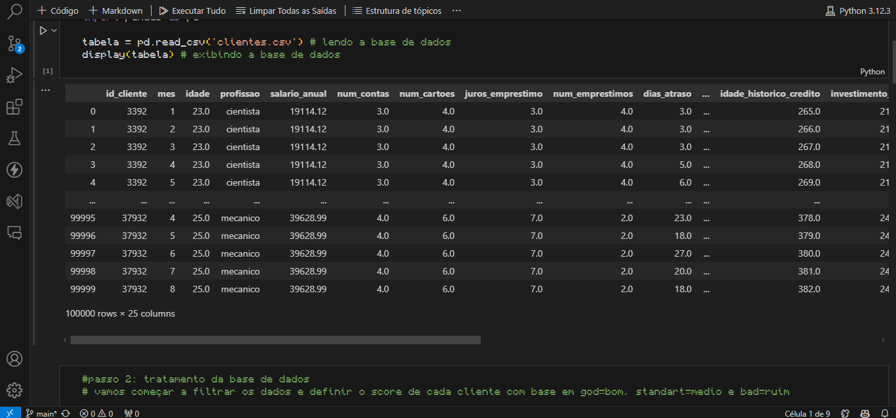
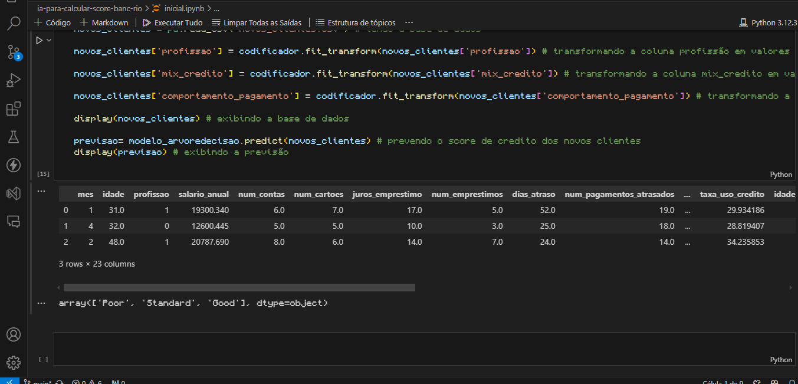

# Projeto 3: IA para Cálculo de Score Bancário

## Descrição
Este projeto envolve o desenvolvimento de uma inteligência artificial em Python e Jupyter que calcula o score bancário de cada cliente e determina quais são os melhores candidatos para oferta de crédito. A IA utiliza técnicas de aprendizado de máquina para análise preditiva.

## Funcionalidades
- Coleta e preparação de dados de clientes.
- Treinamento de modelos de aprendizado de máquina.
- Cálculo do score bancário baseado em diversos critérios.
- Identificação dos melhores candidatos para oferta de crédito.

## Tecnologias Utilizadas
- Python
- Pandas
- Scikit-learn
- Jupyter Notebook

## Imagem do Projeto

## Conclusão
A IA para cálculo de score bancário proporciona uma maneira precisa e eficiente de avaliar clientes para oferta de crédito, minimizando riscos e otimizando a tomada de decisões financeiras.
